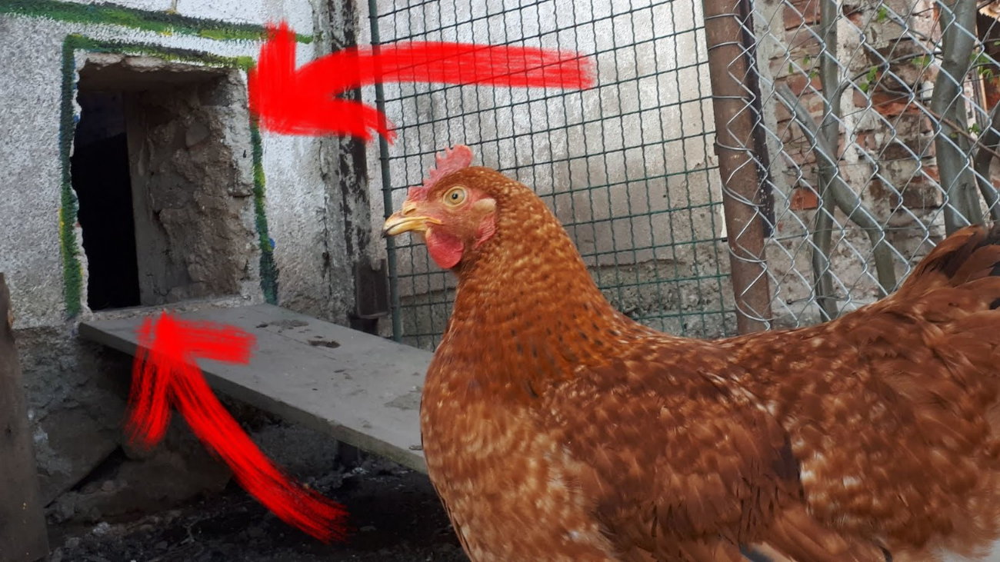

# Chytrý kurník

### Chytrý kurník, aneb už máme WiFi i v kurníku.
Doba se nám mění, a tak se snažíme mnoho věcí zjednodušovat a automatizovat. Z tohoto důvodu jsem navrhl a vytvořil [Chytrý kurník](https://kubaandrysek.cz/2020/04/15/chytry-kurnik). Jedná se o kurník s automatickým otevíráním a zavíráním dvířek v přednastavený čas. Součástí kurníku je také automatické pítko a krmítko, které jsme pro tento účel zakoupili. Díky tomuto vybavení se stává kurník z velké části autonomní.

## [Více informací o projektu](https://kubaandrysek.cz/2020/04/15/chytry-kurnik)

## [Zdrojový kód](https://github.com/JakubAndrysek/Chytry-kurnik)

